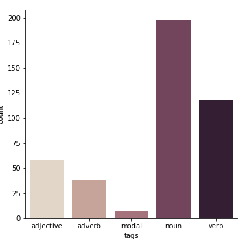

[](https://mybinder.org/v2/gh/Beramos/wordTaggerNLP/master?filepath=wordTaggerNLP.ipynb)

# wordTaggerNLP
Simple notebook to analysis and annotate text

## Example
Speech of the Queen 1957

> Happy Christmas. Twenty-five years ago my grandfather broadcast the first of these Christmas messages. Today is another landmark because television has made it possible for many of you to see me in your homes on Christmas Day. My own family often gather round to watch television as they are this moment, and that is how I imagine you now. I very much hope that this new medium will make my Christmas message more personal and direct. It is inevitable that I should seem a rather remote figure to many of you. A successor to the Kings and Queens of history; someone whose face may be familiar in newspapers and films but who never really touches your personal lives. But now at least for a few minutes I welcome you to the peace of my own home. That it is possible for some of you to see me today is just another example of the speed at which things are changing all around us. Because of these changes I am not surprised that many people feel lost and unable to decide what to hold on to and what to discard ... - Royal.uk

```
analysis.tag_words(speech1)
```

```Words:894
{'other': 453, 'noun': 173, 'verb': 136, 'adjective': 65, 'adverb': 46, 'foreign word': 0, 'modal': 21}
```


